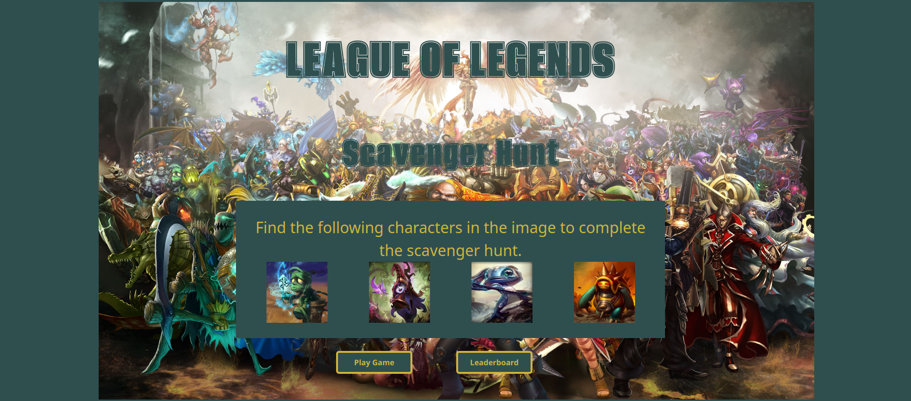
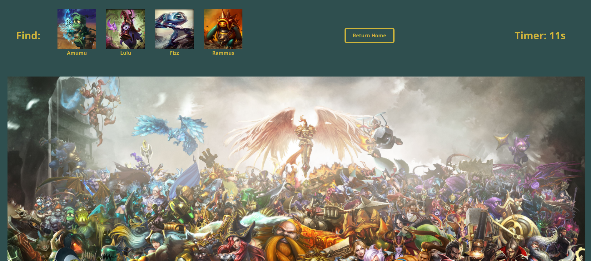
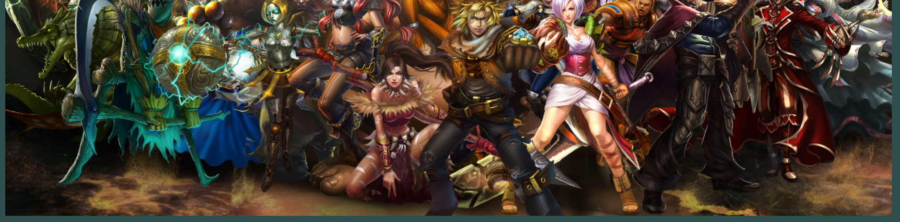
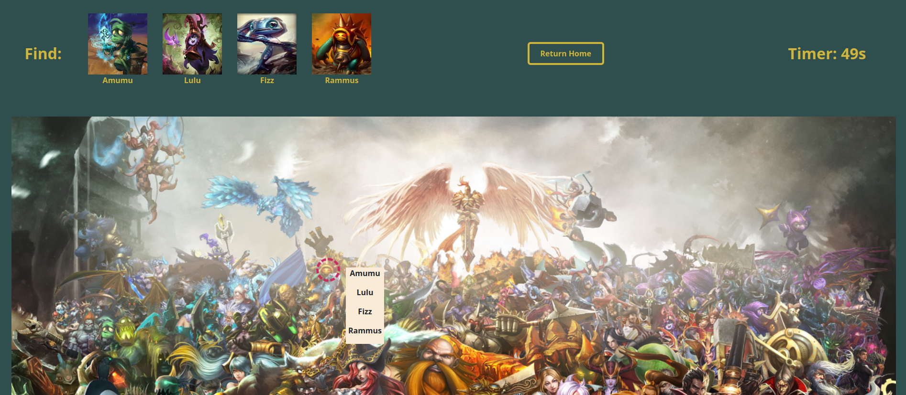
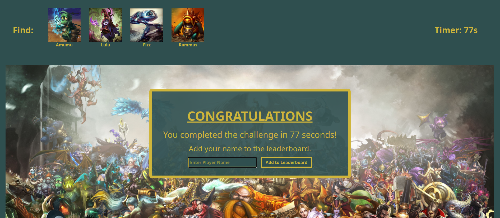
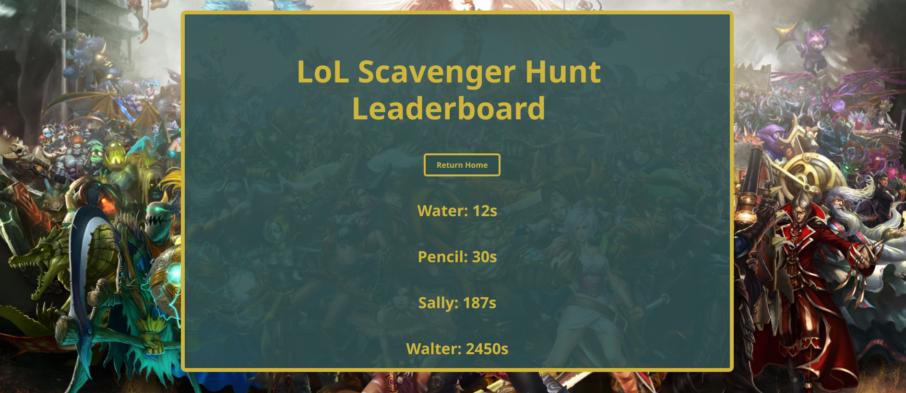

# LoL-Scavenger-Hunt

I created a full-stack photo tagging scavenger hunt game with a League of Legends theme. I used Express, MongoDB, and React to create this full-stack game.

The start page of the game has the title, directions, images, the start game button, and the leaderboard button.

Start Page:

The game page shows the images from the start page again, along with the character names for reference. The page had a return home button in the header while the game is running but not once the game is over and the leaderboard form appears. The timer will run as soon as the player comes to the game page and will stop when the leaderboard form is triggered at the end of the game. If the player returns to the home page the timer will pause until the player gets back to the game page. 

Game Page:

When the player clicks on the image a circle will appear around the area the player clicked and a dropdown will appear. The user can select the name from the list that corresponds with the image. 

Once all characters have been found the leaderboard form will trigger for the player to add their name to the leaderboard. 

The leaderboard page shows the players who have completed the game and their time from least to greatest. The player list is sorted before being sent to the frontend so it is up to date when the new user goes from the game page to the leaderboard page.

***Credits***

1. Gameboard and Start Page Image: lolwallpapers.net

2. Champion Images and Tab Logo: leagueoflegends.com
